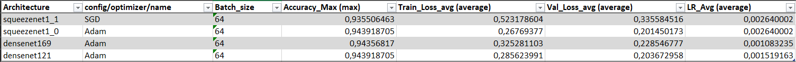

# Oil Palm Detection App Documentation

## 1. How to Run the App
Can an be used for testing our models and predicts the existence of oil palm plantations for any given image set. 

Ensure the following prerequisites are met:

- Have Docker installed ([Docker Desktop](https://www.docker.com/products/docker-desktop/))

- Clone the repository:
```
git clone https://github.com/felixn95/oil-palm-detection.git
```
Inside the project root, execute the run script:
To run with a specific port (e.g., 9000), use: ./run_docker.sh 9000

To run with the default port (8501), just use:
- Bash (Linux/MacOs):
  ```
  ./run_docker.sh
  ```
- Powershell (Windows):
    ```
  .\run_docker.sh
    ```
Building the container could take some minutes, if successfully started the app should be available under

```
localhost:8501
```

## 2. Motivation
 Oil palm is a common ingredient in numerous daily items like shampoo, donuts, and ice cream, remains unfamiliar to many despite its widespread use. This crop thrives exclusively in tropical regions, and its cultivation has resulted in extensive deforestation, heightened carbon emissions, and a reduction in biodiversity. This project aims to address such deforestation issues in various regions globally.

## 3. Dataset 
We utilized the dataset available at [Kaggle](https://www.kaggle.com/c/widsdatathon2019/data), comprising 20,000 labeled satellite images from Borneo. The data consists of images displaying 3m spatial resolution. These are labelled depending on the presence of a palm oil plantation in the picture (0=no plantation, 1=plantation).

## 4. Preprocessing and Explorative Data Analysis (EDA)
Some Adjustments to the dataset were necessary for optimal processing. To understand and validate the dataset, we employed the [Data Gradient Library](https://docs.deci.ai/data-gradients/index.html). Content located in the [data_processing](https://github.com/felixn95/oil-palm-detection/tree/main/data_processing) folder, with two notebooks:
- 01: general necessary preprocessing and some exploration. 
- 02: exploring the labeled confidence score and its affection. 

## 5. Model Training and Tracking
Model training was conducted using [fastai](https://docs.fast.ai/vision.learner.html). We experimented with various pre-trained models, adjusting epochs and learning rates for fine-tuning. For model visualization, comparison, monitoring, and collaboration, we used [NeptuneAI](https://docs.neptune.ai/about/intro/). Training, decentralized across team members using Colab (due to GPU), was centrally tracked using NeptuneAI. Training notebooks are available in the [model_training](https://github.com/felixn95/oil-palm-detection/tree/main/model_training) folder.

The models were trained in different projects, as can be seen in the screenshot below. 


Each member of the team tried different models and parameters, which then have been evaluated and compared. 
## 6. Interpretation & Evaluation
We evaluated the models in this [Excel-Sheet](https://github.com/felixn95/oil-palm-detection/blob/main/model_training/Optimizer_comparison.xlsx). There, a detailed view on all runs can be found. Included are insights on the models parameters and the performance evaluation. Additionally, Screenshots of all tables can be found [here](https://github.com/felixn95/oil-palm-detection/tree/main/model_training). To get a quick overview of our results, the best models can be seen in the image below. 



The best recorded accuracy is 94.3918705% achieved by two models. One models uses a squeezenet architecture, Adam as optimizer and only images that were labeled with a confidence score of .75 or above. The batch size used for training was 64. The other model uses the densenet121 architecture. This model also uses Adam, a batch size of 64 and images with a confidence score of .75 and above. 

An interpretation with some insight of the predictions for a densenet-model was made here [interpretation](https://github.com/felixn95/oil-palm-detection/blob/main/interpretation/interpretation.ipynb).

## 7. UI and Idea for Practical Application
The app allows uploading a single image or a zip file for analysis. Further, we provide two of our best models for selection. Researchers can upload zip files containing numerous satellite images. These images are processed within the docker container, and a summary of positively predicted images is displayed back on the UI. 

For simulation i.e, we used a subset from a different dataset available at [Kaggle](https://www.kaggle.com/c/planet-understanding-the-amazon-from-space/data), featuring images from the Amazonas region. This subset zip of 100 images can be used for testing and simulating the idea, located in [amazonas_showcase](https://github.com/felixn95/oil-palm-detection/tree/main/amazonas_set_showcase). Our models, of course, have never seen these images from the Amazonas data set before, they were just trained on our data set containing images from Borneo (Southasia).  

## 8. Further Steps and Outlook

##### Model Optimization
- **Refine the Model**: Experiment with different architectures and hyperparameters.
- **Data Augmentation**: Implement data augmentation techniques to increase dataset diversity and improve model generalization.
- **Advanced Techniques**: Explore advanced techniques like transfer learning, ensemble models, or fine-tuning strategies to boost performance.

##### Cross-Region Validation
- **Test in Various Regions**: Validate the model across different geographical regions.
- **Ensure Robustness**: Check adaptability to various environmental conditions.

##### Integration with Real-Time Data
- **Partnerships**: Collaborate with satellite companies or governmental agencies.
- **Enhance Utility**: Access real-time data for immediate deforestation detection.

##### User Feedback Mechanism
- **Feedback Feature**: Implement a system for users to provide feedback on model predictions.
- **Continuous Improvement**: Use the feedback for model fine-tuning and enhancement.

